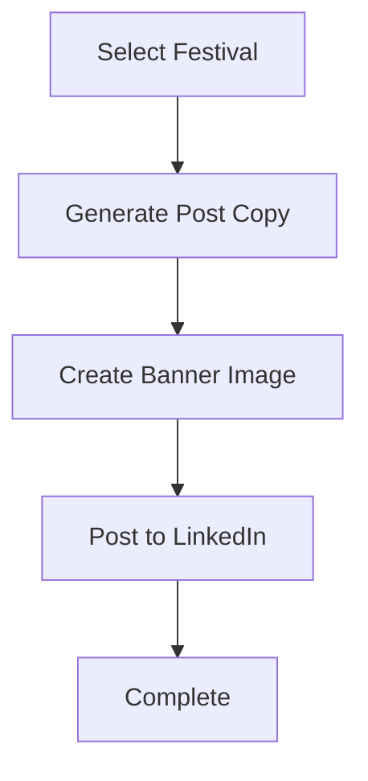

# AutoPost Hub 🎉

An intelligent social media automation tool that creates and posts festival-themed content to LinkedIn using AI. The system automatically detects upcoming festivals from calendar feeds, generates culturally-aware copy, creates custom banners, and publishes engaging posts.

## Features

- **🤖 AI-Powered Content Generation**: Uses OpenAI GPT models to create culturally sensitive, engaging festival posts
- **🎨 Dynamic Banner Creation**: Automatically generates custom festival banners using OpenAI's image generation API
- **📅 Calendar Integration**: Fetches upcoming festivals from ICS calendar feeds
- **🔄 LangGraph Orchestration**: Sophisticated workflow management with state-based execution
- **🌐 Multi-Platform Publishing**: Supports LinkedIn with OAuth authentication
- **🇮🇳 India-Focused**: Optimized for Indian festivals and audience with cultural sensitivity
- **⚙️ Configurable**: Flexible brand tone, hashtags, and posting preferences

## Architecture

```
autopost_hub/
├── __init__.py
├── config/
│   └── settings.py         # Loads .env and config values
├── auth/
│   ├── __init__.py
│   └── oauth_handler.py    # Handles OAuth flows for LinkedIn/X
├── media/
│   ├── __init__.py
│   └── image_generator.py  # Uses Pillow to generate banners
├── content/
│   ├── __init__.py
│   └── festival_content.py # LangGraph logic for festival-aware posts
├── publisher/
│   ├── __init__.py
│   └── post_manager.py     # Posts to LinkedIn/X using requests
├── workflow/
│   ├── __init__.py
│   └── langgraph_flow.py   # LangGraph orchestration
├── utils/
│   ├── __init__.py
│   └── helpers.py          # YAML parsing, date utils, etc.
├── main.py                 # Entry point
└── requirements.txt
```

## Installation

### Prerequisites

- Python 3.12+
- OpenAI API key
- LinkedIn API credentials

### Setup

1. **Clone the repository**
   ```bash
   git clone https://github.com/Chandrashekhar569/AutoPost-Hub-.git
   cd autopost-hub
   ```

2. **Install dependencies**
   ```bash
   pip install -r requirements.txt
   ```

3. **Environment Configuration**
   
   Create a `.env` file in the root directory:
   ```env
   # OpenAI Configuration
   OPENAI_API_KEY=your_openai_api_key
   OPENAI_MODEL=gpt-4o-mini
   IMAGE_MODEL=gpt-image-1
   
   # LinkedIn Configuration
   LINKEDIN_ACCESS_TOKEN=your_linkedin_access_token
   LINKEDIN_AUTHOR_URN=urn:li:person:YOUR_PERSON_ID
   
   # Brand Configuration
   BRAND_NAME=Your Brand Name
   BRAND_TONE=warm, celebratory, professional
   HASHTAGS=#Festival,#Celebration,#Community,#YourBrand
   
   # Calendar Configuration
   CALENDAR_URL=https://calendar.google.com/calendar/ical/your_calendar_id/public/basic.ics
   
   # Storage Configuration
   DOWNLOAD_DIR=./downloads
   ```

## Usage

### Basic Usage

Run the automated festival posting workflow:

```bash
python main.py
```

The system will:
1. 📅 Fetch the next upcoming festival from your calendar
2. ✍️ Generate culturally-aware LinkedIn copy using AI
3. 🎨 Create a custom festival banner
4. 📱 Post to LinkedIn with the generated content and banner

### Advanced Usage

#### Custom Festival Calendar

You can use any ICS calendar feed. Popular options:

- **Google Calendar**: Make your calendar public and use the ICS URL
- **Outlook Calendar**: Export and host your ICS file
- **Custom ICS**: Create your own festival calendar

#### Brand Customization

Customize your brand voice by modifying environment variables:

```env
BRAND_NAME=TechCorp India
BRAND_TONE=innovative, inclusive, tech-forward
HASHTAGS=#TechLife,#Innovation,#IndianFestivals,#TechCorp
```

#### Manual Festival Override

For testing or special occasions, you can override the calendar selection in `main.py`:

```python
# Override for testing
festival = FestivalInfo(
    name="Diwali",
    date=datetime.date(2024, 11, 12),
    emoji="🪔",
    colors=["gold", "orange", "red"]
)
```

## Configuration

### OpenAI Models

- **Text Generation**: `gpt-5` (default), `gpt-4o`, `gpt-3.5-turbo`
- **Image Generation**: `gpt-image-1` (DALL-E 3)

### LinkedIn Integration

1. **Create LinkedIn App**: Visit [LinkedIn Developers](https://developer.linkedin.com/)
2. **Get Access Token**: Use OAuth 2.0 flow to obtain access token
3. **Author URN**: Format as `urn:li:person:PERSON_ID` or `urn:li:organization:ORG_ID`

### Content Guidelines

The AI follows these principles:
- **Cultural Sensitivity**: Respects religious and cultural symbols
- **Professional Tone**: Suitable for LinkedIn's business audience  
- **Inclusive Language**: Avoids stereotypes and clichés
- **Optimal Length**: 80-160 words for maximum engagement
- **Structured Format**: Hook → Insight → Call-to-Action

## Workflow Details

### LangGraph State Machine



### State Structure

```python
class GraphState(TypedDict):
    config: AppConfig
    festival: Optional[FestivalInfo]
    post: Optional[PostDraft]
    banner: Optional[BannerSpec]
    banner_path: Optional[str]
    linkedin_result: Optional[LinkedInPostResult]
```

## API Reference

### Core Models

#### FestivalInfo
```python
class FestivalInfo(BaseModel):
    name: str                    # Festival name
    date: dt.date               # Festival date
    region: Optional[str]       # Geographic region
    emoji: Optional[str]        # Representative emoji
    colors: Optional[List[str]] # Brand colors
```

#### PostDraft
```python
class PostDraft(BaseModel):
    festival: FestivalInfo
    title: str                  # Post title
    body: str                   # Main content
    hashtags: List[str]         # Hashtags list
```

### LinkedIn Client

```python
client = LinkedInClient(access_token)
asset_urn, upload_url = client.register_image_upload(owner_urn)
client.upload_binary(upload_url, image_bytes)
result = client.create_post_with_image(owner_urn, asset_urn, text)
```

## Troubleshooting

### Common Issues

#### Authentication Errors
```bash
# LinkedIn token expired
Error: LinkedIn registerUpload failed: 401 Unauthorized
```
**Solution**: Refresh your LinkedIn access token

#### Calendar Access Issues
```bash
# Calendar URL inaccessible
Error: No upcoming festivals found in client calendar
```
**Solution**: Verify calendar URL is public and contains events

#### Image Generation Failures
```bash
# OpenAI API quota exceeded
Error: OpenAI Image API failed: 429 Rate limit exceeded
```
**Solution**: Check your OpenAI usage limits and billing

### Debug Mode

Enable detailed logging:

```python
import logging
logging.basicConfig(level=logging.DEBUG)
```

## Contributing

We welcome contributions! Please follow these guidelines:

1. **Fork** the repository
2. **Create** a feature branch (`git checkout -b feature/amazing-feature`)
3. **Commit** your changes (`git commit -m 'Add amazing feature'`)
4. **Push** to the branch (`git push origin feature/amazing-feature`)
5. **Open** a Pull Request

### Development Setup

```bash
# Install development dependencies
pip install -r requirements-dev.txt

# Run tests
python -m pytest tests/

# Code formatting
black genai_poster/
isort genai_poster/
```

## License

This project is licensed under the MIT License - see the [LICENSE](LICENSE) file for details.

## Acknowledgments

- **OpenAI** for GPT and DALL-E APIs
- **LangChain/LangGraph** for workflow orchestration
- **LinkedIn API** for social media integration
- **Indian Festival Calendar** contributors

## Support

- 📧 **Email**: Chandrashekhar130697@gmail.com  
- 💬 **Issues**: [GitHub Issues](https://github.com/yourusername/autopost-hub/issues)
- 📖 **Documentation**: [Wiki](https://github.com/yourusername/autopost-hub/wiki)

## Roadmap

- [ ] X (Twitter) integration
- [ ] Instagram support  
- [ ] Multi-language content generation
- [ ] Advanced analytics and engagement tracking
- [ ] Webhook support for real-time posting
- [ ] Template customization UI

---

**Made with ❤️ for celebrating India's rich festival culture through technology**